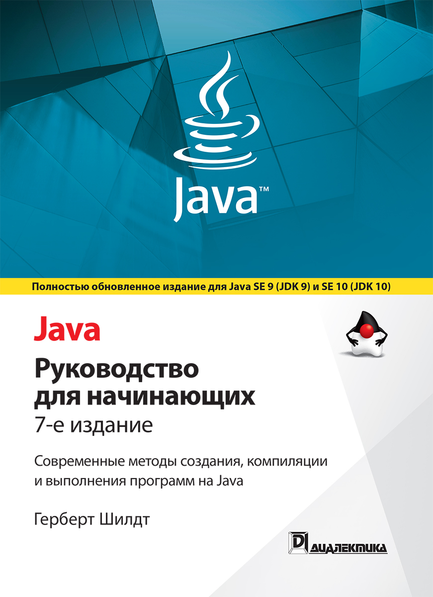

# Изучение-Java

> Изучение Java по книге Герберт Шилдт ✨



## Реализовано:
| Глава | Заголовок                                                         | Выполнено |
| :-----: | ------------------------------------------------------------- | :-------: |
|02| Знакомство с типами данных и операторами                   |✅
|03| Управляющие инструкции                                     |✅
|04| Знакомство с классами, объектами и методами                |✅
|05| Подробнее о типах данных и операторах                      |✅
|06| Подробнее о методах и классах                              |✅
|07| Наследование                                               |✅
|08| Пакеты и интерфейсы                                        |✅
|09| Обработка исключений                                       |✅
|10| Ввод-вывод данных                                          |✅
|11| Многопоточное программирование                             |✅
|12| Перечисления, автоупаковка, статический импорт и аннотации |✅
|13| Обобщения                                                  |✅
|14| Лямбда-выражения и ссылки на методы                        |✅
|15| Модули                                                     |❌
|16| Введение в Swing                                           |❌
|17| Введение в JavaFX                                          |❌

## Компиляция

Рекомендуется использовать JDK 9.

Для компиляции программы FirstProgram запустите компилятор javac, указав в командной строке имя исходного файла:

```sh
cd C:\Learning-Java\src\FirstProgram
javac Example.java
```

Компилятор javac создаст файл Example.class, содержащий байт-код программы.
Для запуска скомпилированной программы следует воспользоваться интерпретатором java.
В качестве параметра ему нужно передать имя класса Example в командной строке:

```sh
java Example
```

В результате выполнения программы в консоль будет выведена следующая строка:

> Java правит Интернетом!

Остальные примеры компилируются по аналогии с вышеперечисленным.

## Лицензия

Свободное использование 😜
